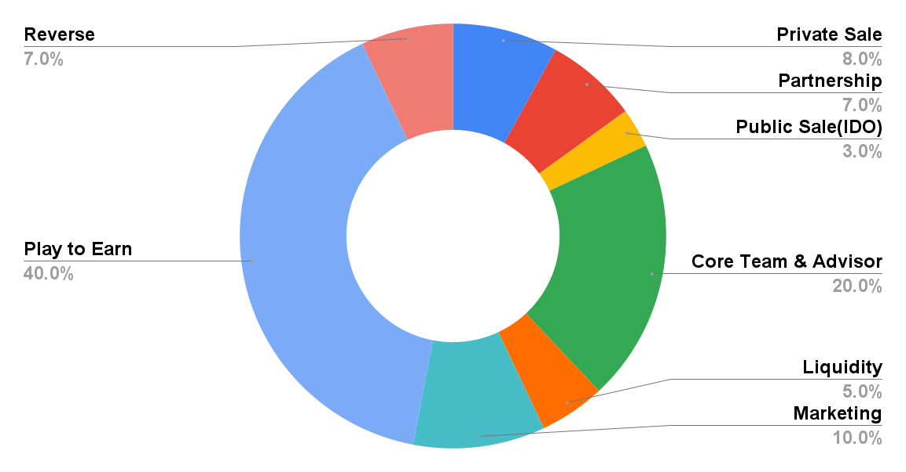

# Tokenomic

## Token ALON

Alon Token (ALN) is the governance token of Mythic Legion: Uprising issued on Binance Smart Chain

The total supply of ALN is 350,000,000 tokens

**ALN contract address (BSC): not yet**



****

## Token Allocation

## **Token Allocation Schedule**

The total supply of ALN will never exceed 350,000,000.

